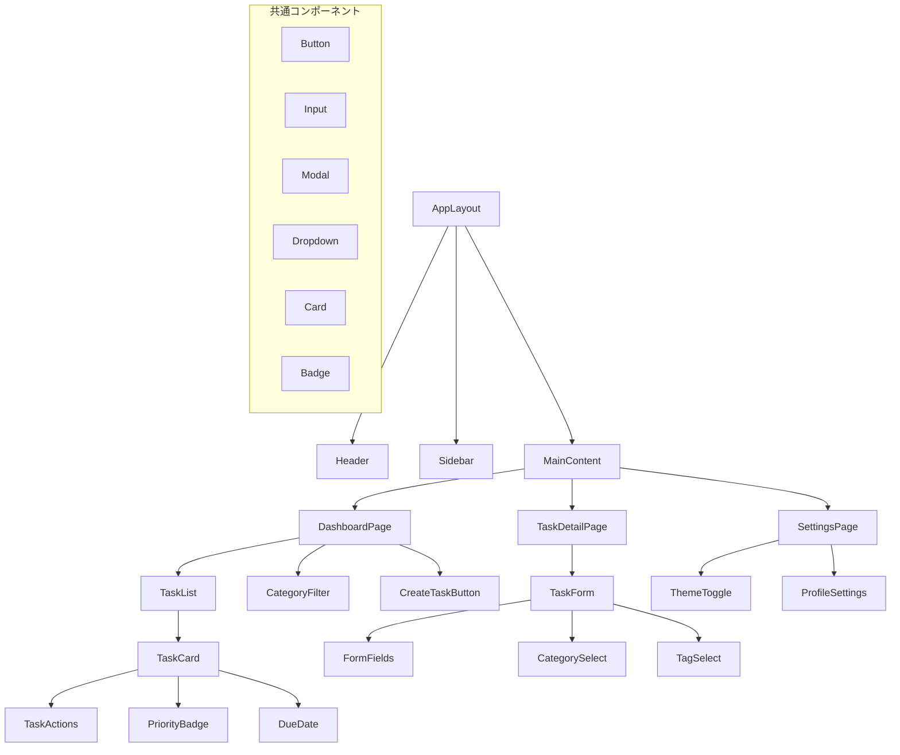
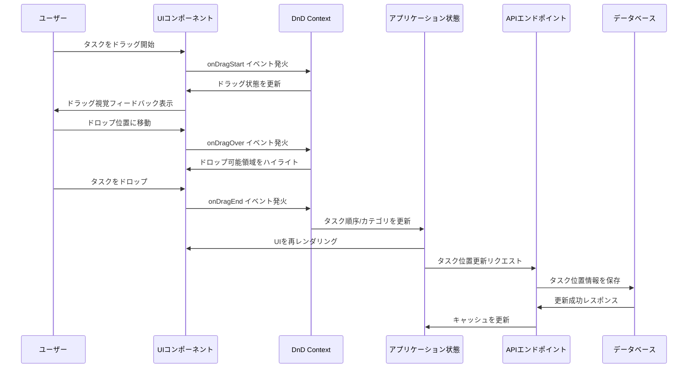

# Issues

## Issue #3: 認証システムの実装（NextAuth.js）
### 詳細:
- NextAuth.jsの設定
- 認証プロバイダーの設定（Email/Password）
- 認証関連のUIコンポーネント（ログイン、登録）の実装
- 認証状態の管理とプロテクテッドルートの設定

### 技術的アプローチ:
- NextAuth.jsの設定ファイルを作成
- PrismaAdapterの設定
- セッション管理の設定
- カスタム認証ページの設定
- 認証ミドルウェアの設定
- 認証関連のUIコンポーネント（ログインフォーム、登録フォーム）の実装
- 認証状態を管理するためのコンテキストプロバイダーの実装

### 完了条件:
- ユーザーがアプリケーションに登録、ログイン、ログアウトできる
- 認証状態が適切に管理され、保護されたルートが機能している
- 認証関連のUIが実装され、ユーザーフレンドリーである

---

## Issue #4: タスクモデルとAPIエンドポイントの実装
### 詳細:
- タスク関連のAPIルートの実装（作成、取得、更新、削除）
- カテゴリとタグのAPIルートの実装
- バリデーションとエラーハンドリングの実装
- APIレスポンスの型定義

### 技術的アプローチ:
- タスク関連のAPIルートの実装（GET、POST、PUT、DELETE）
- カテゴリとタグのAPIルートの実装
- Zodを使用したバリデーションスキーマの定義
- エラーハンドリングの実装
- APIレスポンスの型定義
- 認証チェックの実装

### 完了条件:
- すべてのタスク関連APIエンドポイントが実装され、正常に動作する
- カテゴリとタグのAPIエンドポイントが実装され、正常に動作する
- バリデーションとエラーハンドリングが適切に実装されている
- APIレスポンスが適切な型で定義されている

---

## Issue #5: UIコンポーネントとページの実装
### 詳細:
- 共通コンポーネントの実装（ボタン、入力フィールド、モーダル、カード）
- ページレイアウトの実装（ヘッダー、サイドバー、メインコンテンツ）
- タスク関連のUIコンポーネント（タスクリスト、タスク詳細、タスク作成/編集フォーム）
- カテゴリとタグ管理のUIコンポーネント

### 技術的アプローチ:
- 共通UIコンポーネントの実装（Button、Input、Modal、Card、Dropdown、Checkbox、Toggleなど）
- ページレイアウトコンポーネントの実装（Layout、Header、Sidebar、Footerなど）
- タスク関連のUIコンポーネントの実装（TaskList、TaskCard、TaskForm、TaskDetailなど）
- カテゴリとタグ管理のUIコンポーネントの実装（CategoryList、CategoryForm、TagList、TagFormなど）
- フォームバリデーションの実装（react-hook-formとzodを使用）

### 完了条件:
- すべての共通UIコンポーネントが実装されている
- ページレイアウトが実装され、レスポンシブである
- タスク関連のUIコンポーネントが実装され、機能している
- カテゴリとタグ管理のUIコンポーネントが実装され、機能している

### 補足図（コンポーネント構造）:

---

## Issue #6: 状態管理とデータフェッチングの実装（React Query）
### 詳細:
- React Queryのセットアップ
- タスク、カテゴリ、タグのクエリとミューテーションの実装
- キャッシュの最適化と無効化戦略の実装
- ローディング状態とエラー処理の実装

### 技術的アプローチ:
- React Queryプロバイダーの設定
- タスク関連のクエリフックの実装（useTasks、useTask、useCreateTask、useUpdateTask、useDeleteTaskなど）
- カテゴリとタグ関連のクエリフックの実装
- キャッシュの最適化（staleTime、cacheTimeの設定）
- キャッシュの無効化戦略の実装（queryClient.invalidateQueriesの使用）
- ローディング状態の処理（スケルトンローダー、スピナーなど）
- エラー処理の実装（エラーバウンダリ、トーストメッセージなど）

### 完了条件:
- React Queryが正しく設定され、機能している
- すべてのデータフェッチングとミューテーションが実装されている
- キャッシュの最適化と無効化戦略が実装されている
- ローディング状態とエラー処理が適切に実装されている

---

## Issue #7: ドラッグ&ドロップ機能の実装
### 詳細:
- dnd-kitライブラリの統合
- タスクのドラッグ&ドロップによる並べ替え機能の実装
- タスクのカテゴリ間移動機能の実装
- ドラッグ&ドロップ操作のサーバー同期

### 技術的アプローチ:
- dnd-kitライブラリのインストールと設定
- DndContextプロバイダーの設定
- ドラッグ可能なタスクアイテムコンポーネントの実装
- ドロップ可能なコンテナコンポーネントの実装
- ドラッグ&ドロップイベントハンドラーの実装
- タスクの並べ替え機能の実装
- タスクのカテゴリ間移動機能の実装
- ドラッグ&ドロップ操作のサーバー同期（React Queryミューテーションの使用）

### 完了条件:
- タスクのドラッグ&ドロップによる並べ替えが機能している
- タスクのカテゴリ間移動が機能している
- ドラッグ&ドロップ操作がサーバーと同期されている
- ドラッグ&ドロップ操作が視覚的にフィードバックを提供している

### 補足図（ドラッグ&ドロップフロー）:

---

## Issue #16: Linter・Formatter設定の実装（ESLint + Prettier）
### 詳細:
- ESLintの設定とルール定義
- Prettierの設定とフォーマットルール定義
- TypeScript対応のlinting設定
- Next.js専用のlintingルール設定

### 技術的アプローチ:
- ESLintの設定ファイル（`.eslintrc.json`）作成
- Prettierの設定ファイル（`.prettierrc`）作成
- TypeScript ESLintプラグインの設定
- Next.js ESLintプラグインの設定
- React ESLintプラグインの設定
- package.jsonにlint・formatスクリプトの追加

### 完了条件:
- ESLintが正しく設定され、TypeScriptとNext.jsのルールが適用されている
- Prettierが正しく設定され、コードフォーマットが統一されている

---
